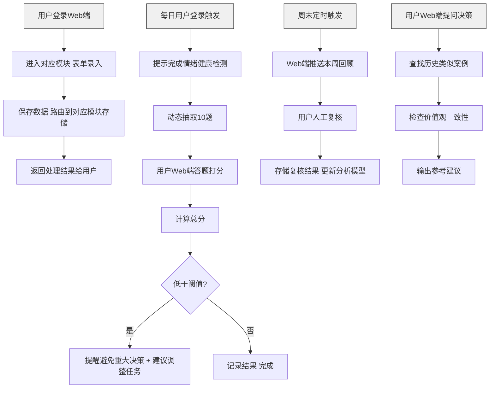
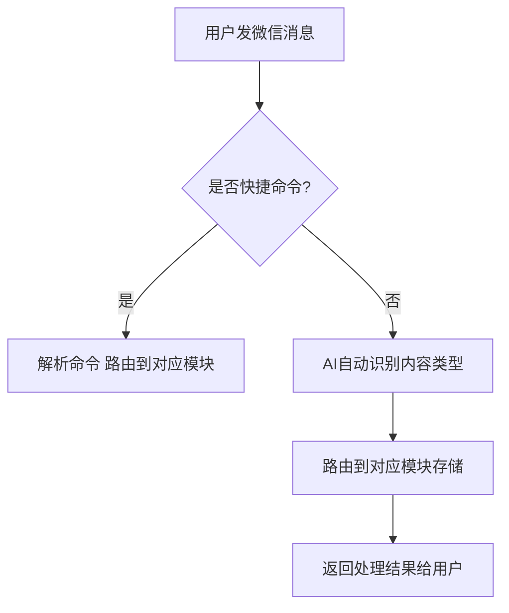

# 个人智能助手 - 产品需求文档 (PRD)

---

## 0. 文档信息

### 0.1 文档信息

| 项 | 内容 |
| --- | --- |
| 当前版本 | 1.0 |
| 当前阶段 | 需求评审 |
| 创建人 | - |
| 创建日期 | 2026-04-21 |
| 最后更新 | 2026-04-21 |
| 核心干系人 | 产品负责人、研发负责人 |

### 0.2 更新记录

| 版本号 | 版本状态 | 更新人 | 更新日期 | 核心更新内容 |
| --- | --- | --- | --- | --- |
| 1.0 | 需求初稿 | - | 2026-04-21 | 完成所有核心功能需求梳理 |

### 0.3 相关文档

- 原始想法记录: `vedeCoding临时想法.md`
- 技术方案设计文档: `个人智能助手技术架构.md`

### 0.4 名词解释

| 术语 | 解释 |
| --- | --- |
| AIDD | AI-Driven Development，AI驱动开发 |
| MCP | Model Context Protocol，大模型上下文协议 |
| Karpathy LLM | Andrej Karpathy 的 llm.c 项目，轻量级LLM训练框架 |
| 三要素 | 事件+情绪+需求，结构化情绪记录的核心框架 |

---

## 一、需求背景与目标

### 1.1 项目概述

本项目是一个**个人私有AI智能助手**，集成情绪管理、知识沉淀、任务管理三大核心能力，通过AI辅助个人成长，帮助用户记录生活、提炼价值观、优化决策质量。

### 1.2 要解决的核心问题

**目标用户画像**:
- 追求自我成长的知识工作者
- 关注心理健康和情绪管理的个人成长实践者
- 需要系统化沉淀知识和想法的学习者

**用户场景**:
- 用户日常生活中会产生很多想法、情绪、待办事项，需要一个统一的地方记录
- 用户做决策时容易受当下情绪影响，需要提醒机制避免在情绪不佳时做重大决策
- 用户读书记笔记，但长时间后想法会变化，需要对比追踪认知变化
- 零散想法需要聚合沉淀，逐步形成明确需求和项目

**核心痛点**:
- 缺少一个私密、端到端加密的个人记录工具，集中管理情绪、想法、任务
- 决策时容易被情绪绑架，缺少客观提醒机制
- 读书笔记零散，无法追踪长时间跨度的认知变化
- 零散想法无法有效聚合沉淀，容易丢失

### 1.3 用户故事

- 故事一: 作为一名个人成长实践者，我想要每天记录自己的情绪和事件，以便于长期追踪我的情绪模式和价值观变化。
- 故事二: 作为一名知识工作者，我想要在情绪不佳时得到提醒，以便于避免在情绪低落时做出重大决策。
- 故事三: 作为一名学习者，我想要导入微信读书的划线笔记，并定期复习回答，以便于看到自己认知的变化。
- 故事四: 作为一名经常产生新想法的人，我想要快速记录零散想法，并自动聚合相似主题，以便于从想法沉淀出明确项目。
- 故事五: 作为一名任务管理者，我想要让今日任务优先级结合我的情绪状态，以便于合理安排工作量。

### 1.4 项目目标与价值

- **用户价值**: 帮助用户记录生活、管理情绪、沉淀知识、优化决策，成为个人成长的AI辅助工具。
- **商业价值**: 探索AI辅助个人成长的产品形态，验证AIDD方法论落地效果。

**项目目标 (SMART原则)**:

- **[S] Specific**: 完成用户体系+情绪日记+任务列表+知识沉淀四大核心模块开发
- **[M] Measurable**: 核心功能可正常使用，支持个人日常记录，数据云端同步
- **[A] Achievable**: 基于现有技术栈，可在可控时间内完成
- **[R] Relevant**: 与探索AI驱动个人成长的方向一致
- **[T] Time-bound**: 完成P0功能开发并可部署运行

### 1.5 需求范围

**In-Scope (范围内，P0+P1)**:
- 用户体系（预留多用户扩展）
- 情绪日记（结构化记录+情绪检测+多周期分析+决策辅助）
- 任务列表（四象限管理+情绪联动）
- 知识沉淀（想法聚合+微信读书笔记整合+MCP知识库接入）
- 探索Karpathy LLM个性化微调（P1）
- Web端录入（第一版）

**Out-of-Scope (范围外，当前不做)**:
- 微信聊天API接入（延后到后续迭代）
- 微信小程序（延后到后续迭代）
- 股票策略分析模块
- 健身记录模块
- 社区社交功能
- 移动App

### 1.6 需求列表 (Requirements List)

| 需求ID | 模块 | 需求描述 | 优先级 | 状态 | 备注 |
| --- | --- | --- | --- | --- | --- |
| R001 | 用户体系 | 用户注册登录，支持微信一键登录、账号密码、验证码三种方式 | 高 | 规划中 | P0 |
| R002 | 用户体系 | Web管理后台，管理员增删用户，不开放自助注册 | 高 | 规划中 | P0 |
| R003 | 用户体系 | 所有业务数据按user_id逻辑隔离，预留多用户扩展 | 高 | 规划中 | P0 |
| R004 | 情绪日记 | Web端录入入口，支持三要素结构化编辑 | 高 | 规划中 | P0 |
| R005 | 情绪日记 | 事件+情绪+需求三要素结构化存储 | 高 | 规划中 | P0 |
| R006 | 微信接入 | 微信统一录入入口，支持一句话识别和快捷命令 | - | 规划中 | 后续迭代 |
| R006 | 情绪日记 | AI自动识别情绪并辅助标注 | 高 | 规划中 | P0 |
| R007 | 情绪日记 | 每日9点微信推送情绪健康检测 | 高 | 规划中 | P0 |
| R008 | 情绪日记 | 动态出题，基于近期情绪调整问题侧重点 | 高 | 规划中 | P0 |
| R009 | 情绪日记 | 6个维度检测，1-5分打分制 | 高 | 规划中 | P0 |
| R010 | 情绪日记 | 问题池外部接入，可动态更新 | 高 | 规划中 | P0 |
| R011 | 情绪日记 | 得分低于阈值时提醒不做重大决策 | 高 | 规划中 | P0 |
| R012 | 情绪日记 | 日/周/月/季度多周期回顾与人工复核 | 高 | 规划中 | P0 |
| R013 | 情绪日记 | 决策辅助，提供历史镜像和价值观一致性参考 | 高 | 规划中 | P0 |
| R014 | 情绪日记 | 客户端加密，密钥用户掌握，云端存密文 | 高 | 规划中 | P0 |
| R015 | 任务列表 | 任务CRUD，支持四象限分类 | 高 | 规划中 | P0 |
| R016 | 任务列表 | 任务可关联情绪记录和知识笔记 | 高 | 规划中 | P0 |
| R017 | 任务列表 | 结合今日情绪检测结果调整任务优先级 | 高 | 规划中 | P0 |
| R018 | 知识沉淀 | 临时想法微信快速录入，自动聚合相似主题 | 高 | 规划中 | P0 |
| R019 | 知识沉淀 | 导入微信读书划线和笔记 | 高 | 规划中 | P0 |
| R020 | 知识沉淀 | 定期提问，对比新旧回答追踪认知变化 | 高 | 规划中 | P0 |
| R021 | 知识沉淀 | MCP协议接入腾讯IMA知识库 | 高 | 规划中 | P0 |
| R022 | AI模型 | 基于Karpathy LLM探索个性化微调 | 中 | 规划中 | P1 |

---

## 二、方案概述

### 2.1 核心业务流程图



**图注**:
- 当前第一版：核心入口为Web端表单录入，包含情绪记录、情绪检测、多周期回顾、决策辅助四大流程
- 后续迭代：将增加微信入口支持一句话快速录入和推送提醒

**后续微信入口规划**:


### 2.2 信息架构图 (IA)

```
个人智能助手
├── 用户体系
│   ├── 登录注册（三种方式）
│   └── 管理后台（用户管理）
├── 情绪日记
│   ├── 结构化记录
│   ├── 情绪健康检测
│   ├── 多周期回顾（日/周/月/季度）
│   └── 决策辅助
├── 任务列表
│   ├── 任务管理
│   ├── 四象限分类
│   ├── 上下文关联
│   └── 每日回顾
└── 知识沉淀
    ├── 临时想法聚合
    ├── 微信读书笔记
    ├── 认知变化追踪
    └── MCP知识库接入
```

---

## 三、细节方案

### 3.1 功能详述：用户体系

#### 3.1.1 交互说明

- **登录页面**: 提供三种登录入口：微信登录、账号密码登录、验证码登录
- **管理后台**: 只有管理员可见，可查看用户列表、新增用户、禁用用户
- **设计原则**: 邀请制，不开放自助注册，管理员手动添加用户

#### 3.1.2 数据需求

- 每个用户分配唯一`user_id`
- 所有业务表必须携带`user_id`字段做数据隔离
- 每个字段必须增加comment的值，用于说明字段的含义

#### 3.1.3 边缘Case处理

- 未登录用户访问 → 跳转到登录页
- 非管理员访问管理后台 → 403拒绝

---

### 3.2 功能详述：情绪日记 - 数据录入

#### 3.2.1 交互说明

- **第一版入口**: Web端表单录入，用户手动填写
- **结构化要求**: 针对情绪记录，用户填写：
  1. **事件**: 客观描述发生了什么
  2. **情绪**: 勾选类型 + 1-5级强度
  3. **需求**: 填写你真正想要什么
- AI自动对文字内容做情绪识别和倾向判断，辅助用户标注

> 后续迭代：微信统一录入入口，支持一句话识别和快捷命令，例如：
> - `/任务 完成PRD文档 重要紧急`
> - `/想法 想到一个新项目思路`

#### 3.2.2 边缘Case处理

- 无法识别内容类型 → 询问用户想录入到哪个模块
- 内容过长 → 支持多行，不做长度限制（加密存储）

---

### 3.3 功能详述：情绪日记 - 情绪健康检测

#### 3.3.1 交互说明

- **执行时机**: 用户登录Web端后，每日提示完成检测，也可随时手动触发
  > 后续迭代：每日上午9点微信推送提醒
- **出题逻辑**:
  - 问题池从外部接入，可动态更新扩展
  - 基于用户近期情绪数据动态调整侧重点（近期焦虑则增加相关问题）
  - 从6个维度各随机抽取，共10题
  - 6个维度：精力水平、情绪稳定性、愉悦感、压力水平、睡眠质量、自信心
- **答题交互**: 每个问题给出1-5分选项，用户点击选择即可，无需打字
- **结果处理**:
  - 计算总分（满分50分）
  - 低于阈值时提醒："你当前情绪状态偏低，建议今天不做重大决策"
  - 建议减少今日高难度任务，安排轻松活动
  - 如果得分异常偏低，引导用户完成一次深度情绪记录

#### 3.3.2 数据需求

- 存储每日检测结果：问题列表、用户打分、总分、是否低于阈值

#### 3.3.3 边缘Case处理

- 用户某天未答题 → 只记录空缺，不强制要求完成
- 网络异常推送失败 → 下次用户互动时再提醒

---

### 3.4 功能详述：情绪日记 - 多周期分析

| 周期 | 分析动作 | 频率 |
|------|----------|------|
| **日** | 自动汇总当日内容，生成结构化笔记 | 每日 |
| **周** | 周末推送本周回顾，邀请人工复核重要事件 | 每周 |
| **月** | 提炼价值观变化趋势，总结常见情绪触发点 | 每月 |
| **季度** | 生成个人决策模式报告，呈现认知变化轨迹 | 每季度 |

**核心闭环**: `记录 → 复核 → 提炼 → 修正`，持续优化个人决策模型。

---

### 3.5 功能详述：情绪日记 - 决策辅助

#### 3.5.1 交互说明

- 用户纠结选择时，可直接在微信向助手提问
- AI从两个核心维度给出参考：
  1. **历史镜像**: 你过去遇到类似情况是什么选择？结果如何？
  2. **价值观一致性**: 这个选项符合你沉淀下来的一贯决策模式吗？
- 集成数学期望计算作为量化参考
- 可引用用户已沉淀的心理学、经济学知识作为判断维度
- **定位**: 不是替用户决策，而是作为镜子帮助用户看清自己

---

### 3.6 功能详述：情绪日记 - 隐私保护

- 个人深度情绪数据在客户端加密后再上传云端
- 加密密钥由用户个人掌握
- 服务端仅存储密文，无法读取明文内容

---

### 3.7 功能详述：任务列表

#### 3.7.1 交互说明

- 可从临时想法和日常记录中提炼可执行任务
- 支持任务创建、编辑、标记完成、删除全生命周期
- 支持**重要紧急四象限**分类：
  1. 重要紧急
  2. 重要不紧急
  3. 紧急不重要
  4. 不重要不紧急
- 每个任务可关联相关的情绪记录和知识笔记
- 做任务回顾时可回看当时的思考过程
- 每日结合情绪检测结果，建议调整任务优先级
- 情绪不佳时提醒避免安排高难度任务

---

### 3.8 功能详述：知识沉淀

#### 3.8.1 临时想法沉淀
- 日常零散想法通过微信快速记录
- 系统自动汇总关联相似主题
- 逐步从零散想法聚合成明确需求
- 支持用户逐步整理完善

#### 3.8.2 微信读书笔记整合
- 导入微信读书划线和笔记数据
- 定期针对历史划线内容发起提问
- 邀请用户给出最新回答
- 通过"旧问题新回答"对比，追踪个人价值观和认知变化轨迹

#### 3.8.3 知识库接入
- 通过MCP协议访问腾讯IMA知识库
- 扩展知识引用能力

---

### 3.9 入口设计

**第一版（当前P0）**:
| 入口 | 角色定位 |
|------|----------|
| **Web端** | 所有功能的录入、查看、分析、管理入口 |

**后续迭代规划**:
| 入口 | 角色定位 |
|------|----------|
| **微信** | 所有模块的主要快速录入入口，接收推送通知 |
| **Web端** | 历史回看、深度分析、数据管理、管理后台 |
| **微信小程序** | 移动端随时随地查看 |

---

### 3.10 非功能性需求

- **性能需求**: Web页面响应在1秒内
- **兼容性需求**: Web端兼容Chrome、Safari、Firefox三大主流浏览器最新版本
- **安全需求**: 敏感数据端侧加密，密钥用户掌握

---

### 3.11 数据统计/埋点需求

本项目为个人工具，暂不要求数据埋点。

---

## 四、上线计划与运营

### 4.1 上线排期 (Roadmap)

按照六阶段开发：

| 阶段 | 时间范围 | 说明 |
|------|----------|------|
| Phase 1 | YYYY-MM-DD ~ YYYY-MM-DD | 基础设施 + 用户体系 + Web核心情绪录入 |
| Phase 2 | YYYY-MM-DD ~ YYYY-MM-DD | 情绪健康检测 |
| Phase 3 | YYYY-MM-DD ~ YYYY-MM-DD | 任务列表 |
| Phase 4 | YYYY-MM-DD ~ YYYY-MM-DD | 多周期分析 + 决策辅助 |
| Phase 5 | YYYY-MM-DD ~ YYYY-MM-DD | 知识沉淀 |
| Phase 6 | YYYY-MM-DD ~ YYYY-MM-DD | Karpathy LLM微调探索 |

*具体日期待后续确认*

### 4.2 灰度发布计划

个人项目，开发完成后直接上线使用。

---

## 五、附录

### Q&A

**Q1**: 微信具体接入方式？
**A1**: 后续确认，架构预留接入位置。

**Q2**: 加密密钥具体存储方式？
**A2**: 后续确认，架构预留加密层。

**Q3**: 情绪检测问题池外部数据源？
**A3**: 后续确认，架构预留接入接口。

**Q4**: 情绪提醒阈值设定？
**A4**: 后续确认，配置可调整。

**Q5**: Karpathy LLM微调算力方案？
**A5**: 后续确认，P1探索性任务。
